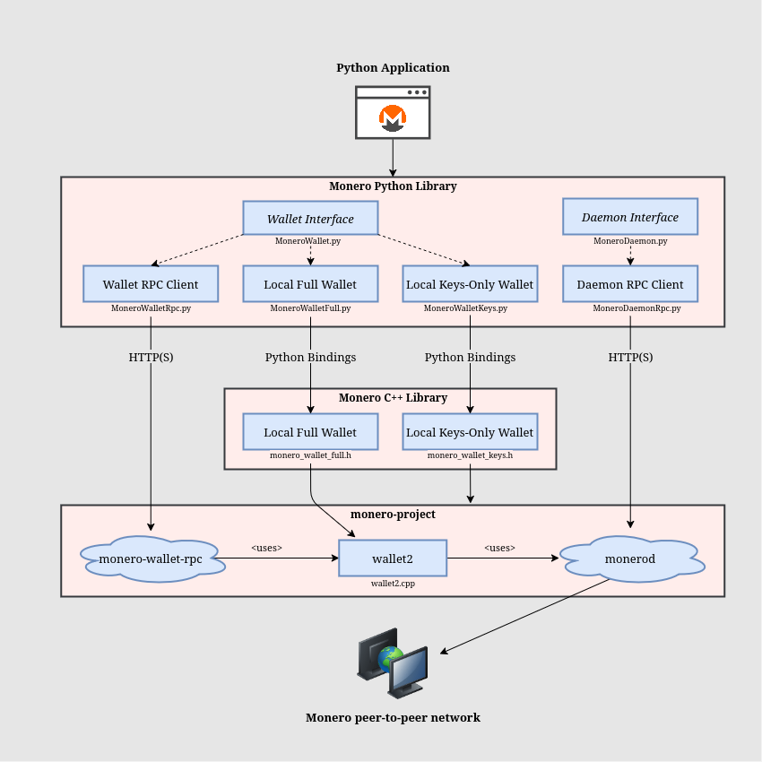

# Monero Python Library
Python library for using Monero

A Python library for creating Monero applications using RPC and Python bindings to [monero v0.18.3.4 'Fluorine Fermi'](https://github.com/monero-project/monero/tree/v0.18.3.4).

* Supports wallet and daemon RPC clients.
* Supports client-side wallets using Python bindings.
* Supports multisig, view-only, and offline wallets.
* Wallet types are interchangeable by conforming to a [common interface](https://woodser.github.io/monero-java/javadocs/monero/wallet/MoneroWallet.html).
* Uses a clearly defined [data model and API specification](https://woodser.github.io/monero-java/monero-spec.pdf) intended to be intuitive and robust.
* Query wallet transactions, transfers, and outputs by their properties.
* Fetch and process binary data from the daemon (e.g. raw blocks).
* Receive notifications when blocks are added to the chain or when wallets sync, send, or receive.

## Architecture

<p align="center">
	<br>
	<i>Build Python
     applications using RPC or Python bindings to <a href="https://github.com/monero-project/monero">monero-project/monero</a>.  Wallet implementations are interchangeable by conforming to a common interface, <a href="https://woodser.github.io/monero-java/javadocs/monero/wallet/MoneroWallet.html">MoneroWallet</a>.</i>
</p>


## Sample code

```python
# connect to daemon
daemon: MoneroDaemon = MoneroDaemonRpc("http://localhost:38081", "superuser", "abctesting123")
height: int = daemon.get_height(); # 1523651
txsInPool: list[MoneroTx] = daemon.get_tx_pool() # get transactions in the pool

# create wallet from mnemonic phrase using Python bindings to monero-project

wallet_config = MoneroWalletConfig()
wallet_config.path = "sample_wallet_full"
wallet_config.password = "supersecretpassword123"
wallet_config.network_type = MoneroNetworkType.STAGENET
wallet_config.server = MoneroRpcConnection()
wallet_config.server.username = "superuser"
wallet_config.server.password = "abctesting123"
wallet_config.seed = "hefty value scenic..."
wallet_config.restore_height = 573936
wallet_full: MoneroWallet = MoneroWalletFull.create_wallet(wallet_config)

# custom wallet listener implementation
listener: MoneroWalletListener = MyWalletListener()

# synchronize the wallet and receive progress notifications
wallet_full.sync(listener)

# synchronize in the background every 5 seconds
wallet_full.start_syncing(5000)

# receive notifications when funds are received, confirmed, and unlocked
wallet_full.add_listener(listener)

# connect to wallet RPC and open wallet
wallet_rpc: MoneroWallet = new MoneroWalletRpc("http://localhost:38083", "rpc_user", "abc123")
wallet_rpc.open_wallet("sample_wallet_rpc", "supersecretpassword123")
primary_address: str = wallet_rpc.get_primary_address() # 555zgduFhmKd2o8rPUz...
balance: int = wallet_rpc.get_balance() # 533648366742
txs: list[MoneroTxWallet] = wallet_rpc.get_txs() # get transactions containing transfers to/from the wallet

# send funds from RPC wallet to full wallet
tx_config = MoneroTxConfig()
tx_config.account_index = 0
tx_config.address = wallet_full.get_address(1, 0)
tx_config.amount = 250000000000 # send 0.25 XMR (denominated in atomic units)
tx_config.relay = False # create transaction and relay to the network if true

created_tx: MoneroTxWallet = wallet_rpc.create_tx(tx_config)
fee: int = created_tx.get_fee() # "Are you sure you want to send... ?"
wallet_rpc.relay_tx(created_tx) # relay the transaction

# save and close wallet
wallet_full.close(true)
```

## Using monero-python in your project

#### For pip:

```bash
pip3 install monero
```

#### For system-wide installation:

```bash
sudo apt install python3-monero
```

#### If using RPC servers:

1. Download and install [Monero CLI](https://web.getmonero.org/downloads/).
2. Start monerod, e.g.: `./monerod --stagenet` (or use a remote daemon).
3. Start monero-wallet-rpc, e.g.: `./monero-wallet-rpc --daemon-address http://localhost:38081 --stagenet --rpc-bind-port 38083 --rpc-login rpc_user:abc123 --wallet-dir ./`

> [!NOTE]
> On Windows, if you want to use native wallets instead of monero-wallet-rpc, or if you want to process binary data, first install MSYS2:
> 1. Install [MSYS2](https://www.msys2.org/).
> 2. Environment variables > System variables > Path > Edit > New > C:\msys64\mingw64\bin

## Building monero-python from source

For convenience, native libraries for Linux, macOS, and Windows are distributed with monero-python, but they can be built independently from source:

### Linux and macOS

1. Install [pip](https://pypi.org/project/pip/) for your system.
2. Install pybind11:<br>
    ```
    pip3 install pybind11 pybind11-stubgen
    ```
3. Clone the project repository: `git clone --recurse-submodules https://github.com/everoddandeven/monero-python.git`
4. `cd ./monero-python`
5. Build the monero-cpp submodule (located at ./external/monero-cpp) as a native library by following [instructions](https://github.com/woodser/monero-cpp#using-monero-cpp-in-your-project) for your system.
6. Build monero-python to ./build/: `./bin/build_libmonero_python.sh`
7. Install monero-python: `pip3 install . `

## Memory Growth

If you see unrestricted memory growth using monero-python, consider applying [jemalloc](https://jemalloc.net/) to improve memory management with `malloc`. In many cases, this can completely resolve the memory growth.

For example: `export LD_PRELOAD=/path/to/libjemalloc.a` then run your app.

## Running Python tests

1. Clone the project repository: `git clone --recurse-submodules https://github.com/everoddandeven/monero-python.git`
2. `cd monero-python`
3. Start RPC servers:
	1. Download and install [Monero CLI](https://web.getmonero.org/downloads/).
	2. Start monerod, e.g.: `./monerod --stagenet` (or use a remote daemon).
	3. Start monero-wallet-rpc, e.g.: `./monero-wallet-rpc --daemon-address http://localhost:38081 --stagenet --rpc-bind-port 38083 --rpc-login rpc_user:abc123 --wallet-dir ./`
4. Configure the appropriate RPC endpoints, authentication, and other settings in [test_utils.py](tests/test_utils.py).
5. Run all *.py files in tests folder with `pytest`.


## Related projects

* [monero-cpp](https://github.com/woodser/monero-cpp)
* [monero-java](https://github.com/woodser/monero-cpp)
* [monero-ts](https://github.com/woodser/monero-ts)

## License

This project is licensed under MIT.

## Donations

Please consider donating to support the development of this project. 🙏

<p align="center">
	<br>
	<code>84rXAu3QhsfbQ2vbxyoEptbRLZ2gtyL8k2qCeJwM5AU4FcxVDEbLRuxMZD5pXD1TR295Nodn7y9mkjoMemHrnMqa9ZnJTza</code>
</p>
